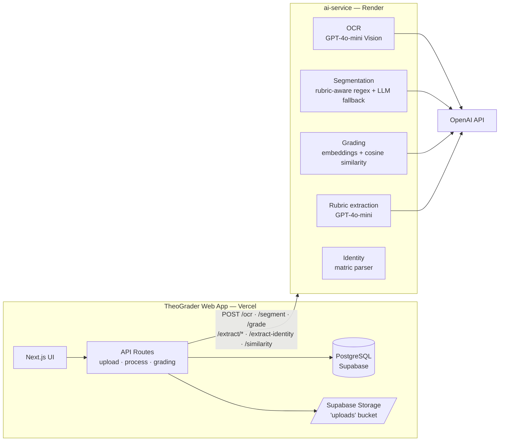
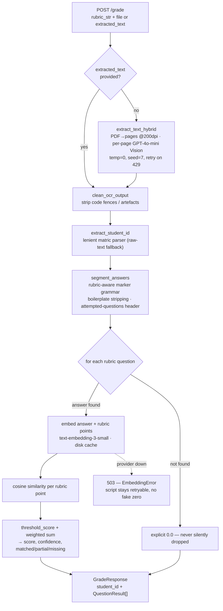
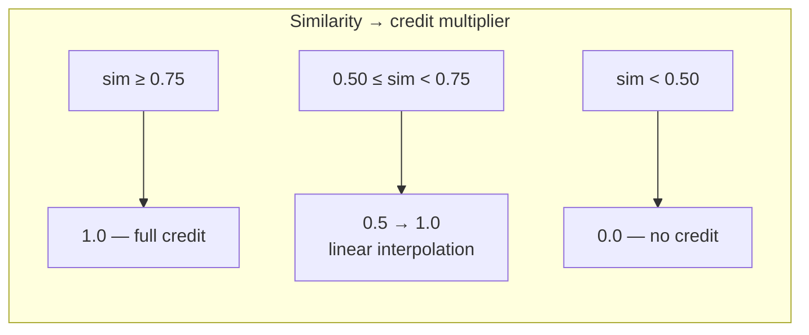

# TheoGrader — AI Service

FastAPI microservice that powers the **OCR → segmentation → semantic grading** pipeline behind [TheoGrader](https://github.com/mayormankind/Theograder).

> Final-year project: *"Design and Development of an Intelligent Assessment System for Automated Grading of Theoretical Examination Scripts in Nigerian Universities."*

Handwritten exam scripts go in as scanned images or multi-page PDFs; rubric-aligned per-question scores come out — deterministically, or not at all. The service is stateless (aside from a small on-disk embedding cache); the Next.js web app owns all persistence.

## Where It Fits



## The Grading Pipeline

`/grade` is the flagship endpoint. It accepts either a file upload (image/PDF) *or* pre-extracted text, plus a JSON rubric, and returns a score for **every** rubric question.



## Scoring Model

Each rubric point gets a cosine similarity against the student's answer, mapped through a two-band threshold, then marks are distributed by weight:



```
score(question) = Σᵢ ( wᵢ / Σw ) × questionMaxScore × band(simᵢ)
confidence      = mean(similarities)
```

- Thresholds live in `app/config/constants.py` (`SIMILARITY_FULL = 0.75`, `SIMILARITY_PARTIAL = 0.50`).
- Linear interpolation avoids the cliff edge where a 0.74 similarity scored the same as 0.51.
- The response also breaks every rubric point into `matched_concepts` (≥ 0.75), `partial_concepts` (0.50–0.75), and `missing_concepts` (< 0.50) so the UI can show *why* a score was given.

## Design Rules

These are deliberate invariants — keep them when modifying the service:

| Rule | Where | Why |
|---|---|---|
| **Determinism** | `temperature=0`, `seed=7` (OCR), `seed=42` (segmentation fallback) | Re-grading the same script must produce the same score. |
| **Never silent-zero** | `EmbeddingError` → HTTP 503 in `grading.py` | A zero-vector yields cosine 0.0; on an API outage that would *fabricate* a zero score. The request fails instead and the script stays retryable. |
| **Zero-vector is only for blank answers** | `embeddings.py` | An empty answer legitimately embeds as all-zeros; an API failure never does. |
| **Iterate the rubric, not the segments** | `grading.py` | Every rubric question gets a `QuestionResult` — an unanswered question scores an explicit `0.0` instead of vanishing from the report. |
| **Rubric-aware segmentation** | `expected_labels` param | Passing the rubric's canonical labels makes segmentation deterministic and stops answers merging/fragmenting on odd labelling styles (`1(a)`, `Q2b`, `(i)`, `Answer 3`…). |
| **Embedding cache** | `embedding_cache.json`, keyed by raw text, 6000-char cap | Rubric points repeat across scripts; caching cuts cost and latency. Flushed to disk on shutdown. |
| **Boilerplate stripping** | `segmentation_service.py` | FUTA answer-book headers ("Directions to candidates", "For Examiner's use only", page footers) are removed before embedding so they don't pollute similarity. |
| **Lenient matric parsing** | `identity.py` | Normalises common OCR errors (`I/1`, `S/5`, `O/0`, missing slashes, `92-93` dash serials) to canonical `LLL/DD/DDDD`, and falls back to the raw text so the lecturer always has something editable. |

## API Endpoints

| Method | Path | Input | Purpose |
|---|---|---|---|
| `GET` | `/` | — | Service health/info |
| `GET`, `HEAD` | `/health` | — | Render health check |
| `POST` | `/ocr` | `file` (multipart) | Transcribe image/PDF → `{extracted_text, extraction_method, confidence_flag}` |
| `POST` | `/ocr-from-url` | `{url}` | Download then OCR a remote file |
| `POST` | `/segment` | `{raw_text, expected_labels?}` | Split OCR text into `{label: answer}` |
| `POST` | `/grade` | `rubric_str` + `file` *or* `extracted_text` (form) | Full pipeline → `GradeResponse` |
| `POST` | `/similarity` | `{student_answer, rubric[]}` | Standalone cosine similarity check |
| `POST` | `/extract/from-document` | `file` (PDF/image) | Parse a marking scheme → structured rubric JSON + confidence |
| `POST` | `/extract/from-text` | `text` (form) | Same, from pasted text |
| `GET` | `/extract/health` | — | Rubric-extraction health |
| `POST` | `/extract-identity` | `{url}` | OCR first page only → `{matric, confidence, raw_text}` |

Interactive docs (Swagger UI) are available at `/docs` when the server is running.

### `/grade` response shape

```json
{
  "student_id": "IFS/24/9279",
  "questions": [
    {
      "question": "1",
      "answer": "The nucleus controls the cell...",
      "score": 14.5,
      "confidence": 0.78,
      "breakdown": [0.81, 0.66, 0.42],
      "matched_concepts": ["Nucleus is the control centre"],
      "partial_concepts": ["Contains genetic material"],
      "missing_concepts": ["Surrounded by nuclear membrane"]
    }
  ]
}
```

## Tech Stack

| Layer | Choice |
|---|---|
| Runtime | Python 3.11, FastAPI, Uvicorn |
| OCR | GPT-4o-mini Vision (`detail: high`), `pdf2image` + poppler for PDF→image |
| Embeddings | `text-embedding-3-small` (1536-d), numpy cosine similarity, JSON disk cache |
| LLM fallbacks | `gpt-4o-mini` (segmentation, rubric extraction) |
| Deploy | Docker on Render (`render.yaml`, `Dockerfile`) |

## Getting Started

### Prerequisites

- Python 3.11+
- An OpenAI API key
- `poppler` (for `pdf2image`) — only needed for local PDF OCR; the Dockerfile already installs `poppler-utils`. On Windows install poppler and add its `bin/` to `PATH`.

### Setup

```bash
python -m venv venv
venv\Scripts\activate          # Windows
# source venv/bin/activate     # macOS/Linux

pip install -r requirements.txt
```

Create `.env` in the repo root:

```env
OPENAI_API_KEY=your-openai-api-key-here
PORT=8000
```

### Run

```bash
uvicorn app.main:app --reload
```

Server: `http://127.0.0.1:8000` — Swagger UI at `/docs`, health at `/health`.

### Docker

```bash
docker build -t ai-service .
docker run -p 8000:8000 -e OPENAI_API_KEY=... ai-service
```

or `docker compose up` (see `docker-compose.yml`).

## Deployment

Deployed as a Docker web service on **Render** (see `render.yaml`):

- Service name: `ai-service`, free plan, `autoDeploy: true`
- Health check path: `/health`
- Required env var: `OPENAI_API_KEY` (set in the Render dashboard)
- Free-tier note: Render spins down after inactivity — the first request after idle can take ~30–60s. The web app's `AIClient` retries with exponential backoff to absorb cold starts.

## Project Layout

```
ai-service/
├── app/
│   ├── main.py                    # FastAPI app, CORS, router wiring, /segment, /health
│   ├── config/
│   │   └── constants.py           # SIMILARITY_FULL / SIMILARITY_PARTIAL thresholds
│   ├── models/
│   │   ├── request_models.py      # SimilarityRequest, SegmentRequest
│   │   └── response_models.py     # GradeResponse, QuestionResult
│   ├── routes/
│   │   ├── ocr.py                 # /ocr, /ocr-from-url
│   │   ├── grading.py             # /grade — the full pipeline
│   │   ├── similarity.py          # /similarity
│   │   ├── rubric_extraction.py   # /extract/* — marking scheme → rubric JSON
│   │   └── identity.py            # /extract-identity, lenient matric parser
│   ├── services/
│   │   ├── ocr_service.py         # GPT-4o-mini Vision transcription, PDF→images
│   │   ├── segmentation_service.py# marker grammar, boilerplate stripping, LLM fallback
│   │   ├── embeddings.py          # embedding client + disk cache + EmbeddingError
│   │   ├── embedding_service.py   # get_embeddings shim (batch)
│   │   └── scoring_service.py     # cosine → threshold bands → weighted marks
│   └── utils/
│       └── text_preprocessing.py  # clean_ocr_output, extract_student_id, preprocess
├── embedding_cache.json           # persisted embedding cache
├── Dockerfile                     # python:3.11-slim + poppler
├── docker-compose.yml
├── render.yaml                    # Render service definition
├── requirements.txt
└── start.sh
```
